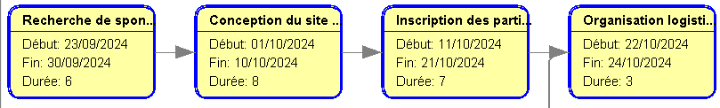
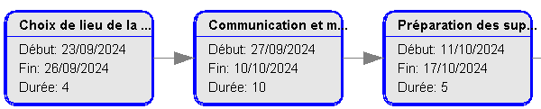

# Interpréter le diagramme

Yoan & Constant

1. Le projet dure minimum 24 jours
2. Tâches critiques 
3. Tâches qui possédent une marge de flottement   5 jours de marge
4. Les tâches ci dessus sont aussi les tâches que l'on peut retarder sans impacter la durée du projet
  